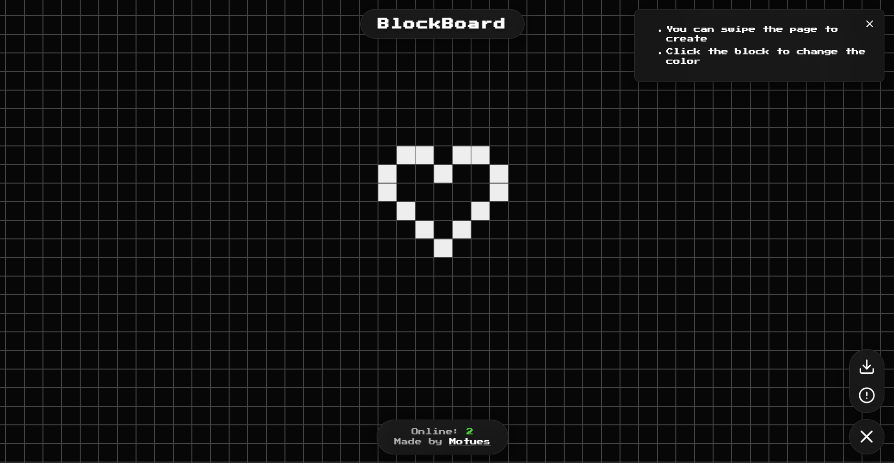

# BlockBoard

A real-time online block board



## Deployment

1. Clone the repo
    ```bash
    git clone https://github.com/Motues/BlockBoard.git
    ```
2. Install dependencies
    ```
    cd BlockBoard
    pnpm install
    ```
3. Start the server
    ```
    pnpm build
    pnpm start
    ```
    then open http://localhost:33333

## Configuration

Configure the server in `game-config.json`

| Name | Description |
| --- | --- |
| `rows` | The number of rows in the board |
| `cols` | The number of columns in the board |
| `cellSize` | The size of each block in pixels |
| `port` | The port the server will listen to |