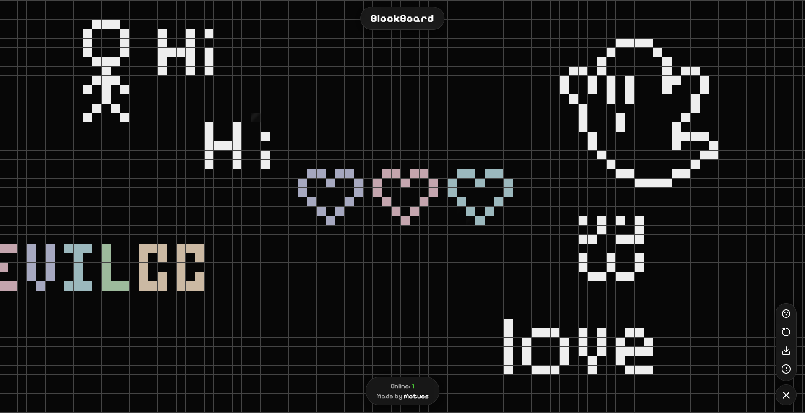

# BlockBoard

A real-time online block board

**English** | [中文](./README.zh-CN.md)



## Deployment

1. Clone the repo
    ```bash
    git clone https://github.com/Motues/BlockBoard.git
    ```
2. Install dependencies
    ```
    cd BlockBoard
    pnpm install
    ```
3. Start the server
    ```
    pnpm build
    pnpm start
    ```
    then open http://localhost:33333

## Configuration

Configure the server in `game-config.json`, reference to the file `game-config.json.example`

| Name | Description |
| --- | --- |
| `rows` | The number of rows in the board |
| `cols` | The number of columns in the board |
| `cellSize` | The size of each block in pixels |
| `port` | The port the server will listen to |
| `devPassword` | Password for the developer tools. Leave it empty to keep them disabled; the `DEV_PASSWORD` environment variable takes precedence over this field |
| `devSessionHours` | How long a developer session stays valid, in hours (default 8) |

## Language

The interface is available in Chinese and English. On the first visit the language follows the
browser (`navigator.language`): a Chinese browser gets Chinese, everything else gets English. The
choice is remembered in the browser (`localStorage`, key `blockboard-language`) and can be changed at
any time in the settings dialog.

## Buttons

Three round buttons sit in the bottom-right corner, all the way at the bottom of the screen:

| Button | Icon | What it does |
| --- | --- | --- |
| **Developer tools** | terminal | Signs in / opens the developer tools (see below) |
| **Settings** | gear | Opens the settings dialog, centred on the screen |
| **Menu** | … | Opens the options panel: Brush Color / Reset View / Save as Image / Show Help |

On touch devices (no hover, coarse pointer) the **Developer tools** button is hidden — the developer
mode needs a left and a right mouse button, so it is desktop-only. The **Settings** entry moves into
the options panel in that case (the last item of the menu button), so the language and the developer
password can still be changed on a phone or tablet.

## Brush colors

**Short press** the right button on the board to open the brush ring: releasing it before ~220 ms have
passed and before the cursor moved ~6 px pops the ring up at the cursor, while **holding** it (or
moving right away) pans the board instead, so the right button doubles as a drag handle on desktop.
A quick left click paints / erases a block; on desktop the left button no longer pans the view.

> **On Edge:** the built-in *mouse gestures* take over right-button dragging, and a web page cannot turn
> them off, so holding the right button no longer pans the board. On desktop Edge a small card appears in
> the bottom-left corner on the first visit: its button tries to open the mouse gesture settings
> (`edge://settings/appearance/browserBehavior/mouseGestures`), and the address is also copied to the
> clipboard (shown on the card) in case the browser blocks it. Turn off *Enable mouse gestures* there —
> newer builds also let you add this site to the gesture block list.

The ring holds the preset colors; the rainbow circle in the middle picks **any 24-bit RGB color**: it
opens a picker with a saturation/brightness area, a hue slider and a hex field (`#rgb` / `#rrggbb`).
The picked color is applied to the brush immediately, and the choice is remembered in `localStorage`.

Two extras live in that picker:

- **Eyedropper** — the button left of *Done* enters picking mode. The cursor turns into an eyedropper,
  the block under it grows a little without the usual wave animation, and a small floating chip follows
  the cursor showing that block's color as `#rrggbb`. Clicking a block makes its color the brush color
  (a preset when it matches one, otherwise a custom 24-bit color) and leaves picking mode; `Esc` cancels.
- **Recent colors** — the row of swatches at the top of the picker keeps the last 10 brush colors
  (`localStorage`, key `blockboard-recent-colors`), newest first and de-duplicated. Pure black is
  skipped because it is the eraser color. Clicking a swatch selects it again.

## Settings

The gear button opens a small dialog in the middle of the screen with two fields:

- **Language** — Chinese or English, applied immediately.
- **Developer password** — stored in this browser only (`localStorage`, key
  `blockboard-dev-password`). It is a convenience: when you click the developer tools button, this
  saved password is used to sign in, so you do not have to type it again. Saving it empty forgets it.

Everything here lives in the browser, nothing is sent to the server. **Close** discards the changes,
**Save** stores them.

## Developer tools

Click the **Developer tools** button in the bottom bar to enter the mode:

- If a developer password is already saved in this browser, the click signs in with it immediately —
  no dialog.
- If no password is saved yet, the password dialog opens. A successful sign-in remembers the password
  in this browser.
- If the saved password is rejected (the server answers `401`), the saved password is forgotten and the
  password dialog opens again for re-entry.
- If the server has the developer tools disabled (no `DEV_PASSWORD` / `devPassword`), the click only
  shows a notice; too many failed attempts show the lockout notice.

Logging in exchanges the password for a random 32-byte token that lives in the server's memory for
`devSessionHours` (8 h by default) and in the browser's `localStorage` (`blockboard-dev-token`), so a
page refresh keeps the session. Logging out invalidates it server-side immediately, and restarting the
server invalidates every token. Failed attempts from the same IP are locked out for 5 minutes after 5
tries.

While the mode is on a banner sits at the top of the screen with an **Exit** button.

- **Left button**: drag to marquee-select a rectangle — moving straight away starts the selection, and
  holding still for ~260 ms does the same, so either way the rectangle follows the cursor. A click
  without dragging (under 6 px) targets the closed region the block belongs to instead. Normal
  painting is disabled in this mode.
- **Right button** opens a menu for the current target: fill it with the brush color, reset it to
  black, pick a custom color from the palette, or export it (PNG + JSON). With a marquee selection
  active the menu also offers "clear selection". The menu no longer lists the preset palette colors.
- **Closed region fill** is computed in the browser: a 4-connected flood fill of the clicked block's
  color that must not reach the board edge. If it does, the operation is refused with "region is not
  closed" instead of flooding the board.

The operations go through `POST /api/dev/paint`.

---

The details of the architecture, the state format, the socket protocol or the HTTP endpoints live
in [AGENT.md](./AGENT.md) (Chinese).
